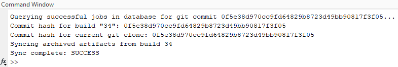

# Workflow Example for Simulink Cache and Jenkins

[](https://www.mathworks.com/matlabcentral/fileexchange/100376-workflow-for-simulink-cache-and-jenkins)

[](https://matlab.mathworks.com/open/github/v1?repo=mathworks/simulink-cache-jenkins-workflow)

This repository contains a Simulink® project and a few utility scripts, which highlight an Agile development workflow using Jenkins™, Git™, and Simulink® cache files.


This workflow has three major steps:
1. Team members commit design changes to Git™ .
2. Jenkins pulls design changes from Git™ , runs simulations to test them, and archives the Simulink® cache files in the Jenkins build archive.
3. Team members sync the latest design changes from Git™  and the associated cache files from the build archive, and then run system simulations using the cache files.


## Important References

We used the following articles to create this example.

1. [Continuous Integration for Verification of Simulink® Models](https://www.mathworks.com/company/newsletters/articles/continuous-integration-for-verification-of-simulink-models.html#configure_jenkins)
discusses setting up and configuring a MATLAB® project to work with Jenkins™ and GitLab® and also covers using Continuous Integration with Simulink®.
2. [Agile Model-Based Design: Accelerating Simulink® Simulations in Continuous Integration Workflows](https://www.mathworks.com/company/newsletters/articles/agile-model-based-design-accelerating-simulink-simulations-in-continuous-integration-workflows.html)
goes over this workflow and best practices in more detail.

## Requirements

Release R2021a

## MathWorks Products 

(https://www.mathworks.com)

* MATLAB
* Simulink
* Stateflow
* Aerospace Toolbox
* Aerospace Blockset
* Simulink 3D Animation
* Embedded Coder
* Database Toolbox

## Notes

- We installed and configured Jenkins as recommended by the above-mentioned articles. 

- In this example, we keep track of the Simulink® cache files corresponding to each Jenkins build using a SQLite database. The database is located on a network and is accessible to everyone on the team and to the Jenkins machine.

- We use the scripts in ```ci_tools``` to access this database and the build archive to retrieve the Simulink® cache files into the project's cache folder.

- The script ```getJenkinsAttributes.m``` contains hard-coded userid and Jenkins API token to fetch build information from Jenkins.

- Additionally, we use the script ```syncSLXCForCurrentHash.m``` to sync Simulink® cache files from the build archive.


## License

The license for Workflow Example for Simulink Cache and Jenkins is available in the [license.txt](license.txt) file in this repository.

## Community Support
[MATLAB Central](https://www.mathworks.com/matlabcentral)

Copyright 2023 The MathWorks, Inc.
